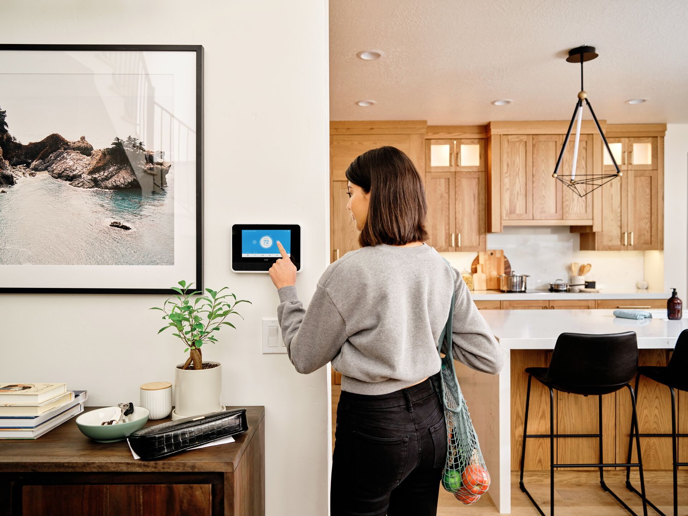

# Customer Instructions

<figure><figcaption></figcaption></figure>



#### Make sure the customer fully understands how to use both the Vivint App and their panel.

* Make sure the customer is in front of the panel and interacting with it.
* Let the customer perform all actions while you are instructing them. This reinforces proper use of the system.


