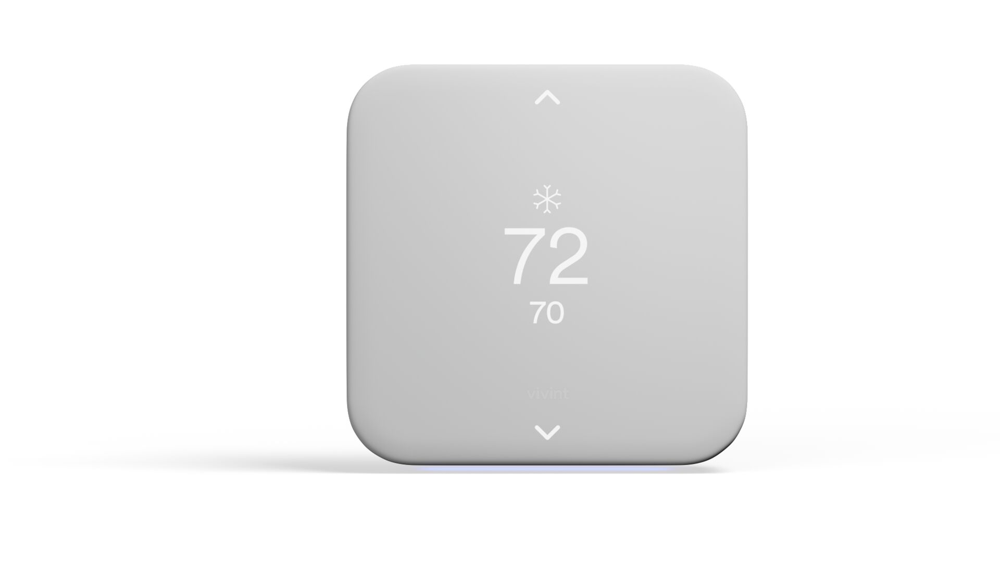
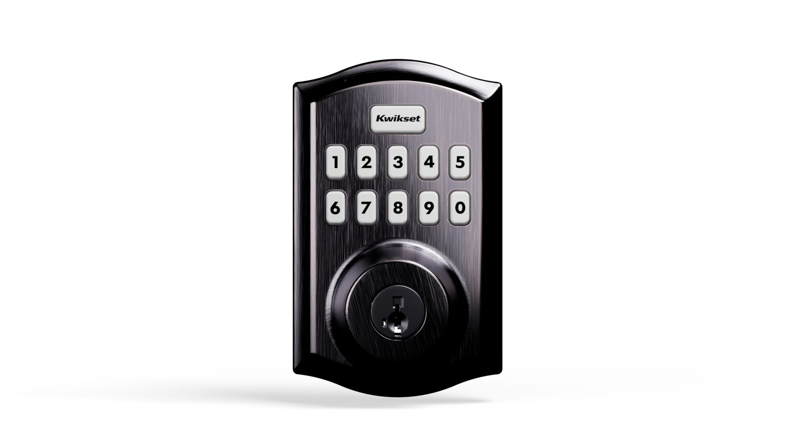
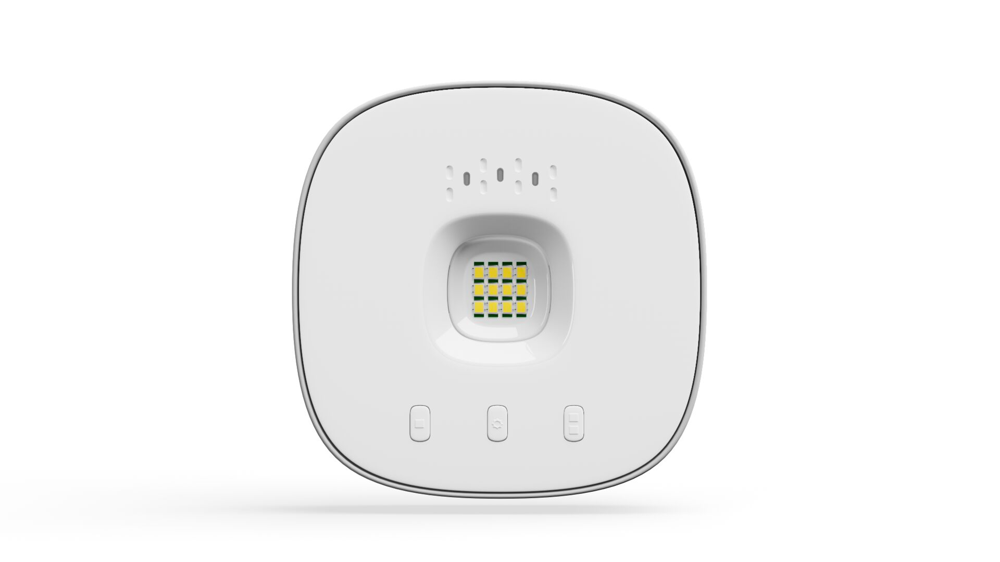

# 10. Install/Pair Automation Devices

<figure><figcaption></figcaption></figure> <figure><figcaption></figcaption></figure> <figure><figcaption></figcaption></figure>



### Install applicable Automation device(s).

* [Smart Lock](https://prosource.vivint.com/sop-smart-locks/)
* [Smart Thermostat](https://prosource.vivint.com/element-v2-sop/)
* [MyQ](https://prosource.vivint.com/smart-garage-hub-product-sop/)
* [Chime Extender](https://prosource.vivint.com/chime-extender/)
* [Lamp Module](https://prosource.vivint.com/lamp-module/)
* [Smart Lighting](https://prosource.vivint.com/smart-lighting/)\*


\*If installing smart lighting, these **do not** need to be installed in their final location before pairing. Pairing should take place next to the Zigbee bridge first before installing.




### Pair Automation device(s).

1. Devices must be in their final location before pairing. This will ensure they will communicate with the panel.
2. Each device must be named according to the location where it is installed.


