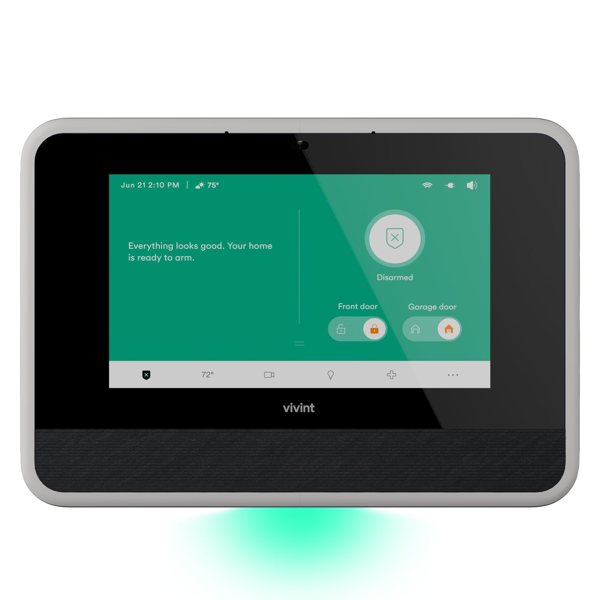

# 6. Mount the Panel

<figure><figcaption></figcaption></figure>



#### Determine panel location.

* Use the [Airport Utility App](https://prosource.vivint.com/airport-utility-app-sop/) to identify the best location(s) for the panel.
* The DBC and the customer's Wi-Fi are in fixed locations. The panel must be in a location where connection to both the DBC and the Wi-Fi router is -65 or better.



#### Mount the panel.

1. Use a level.
2. Use at least 4 screws to secure the wall mount.
   1. Use anchors if mounted to drywall.




[Smart Hub on ProSource](https://prosource.vivint.com/sop-smart-hub/)


