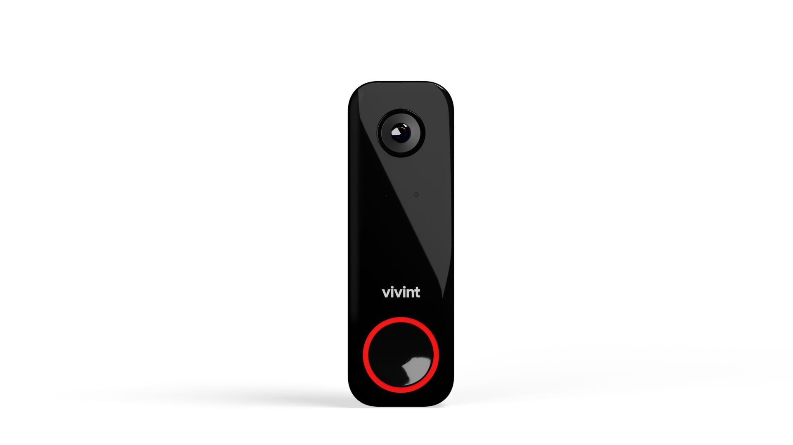

# Pair the DBC Pro

<figure><figcaption></figcaption></figure>



#### Pair the DBC Pro.

* Once the pairing process begins, move onto the next step. Let the camera fully update and come online before doing other programming.


