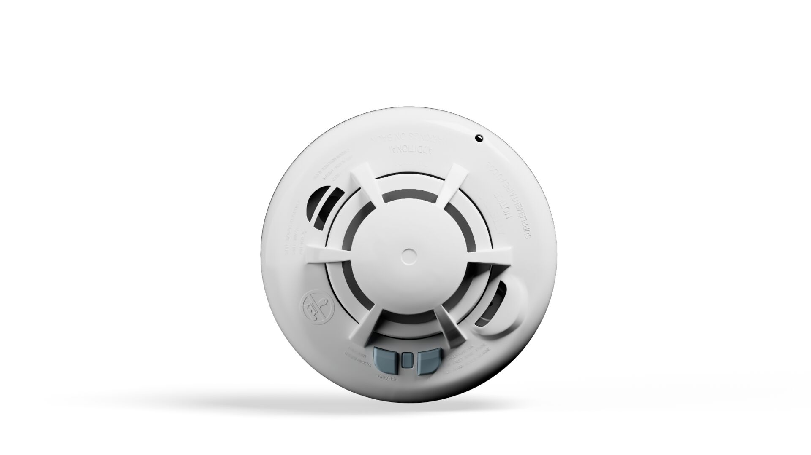
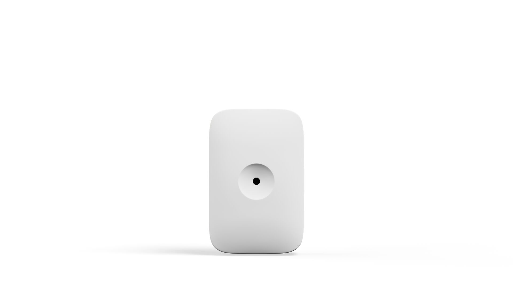
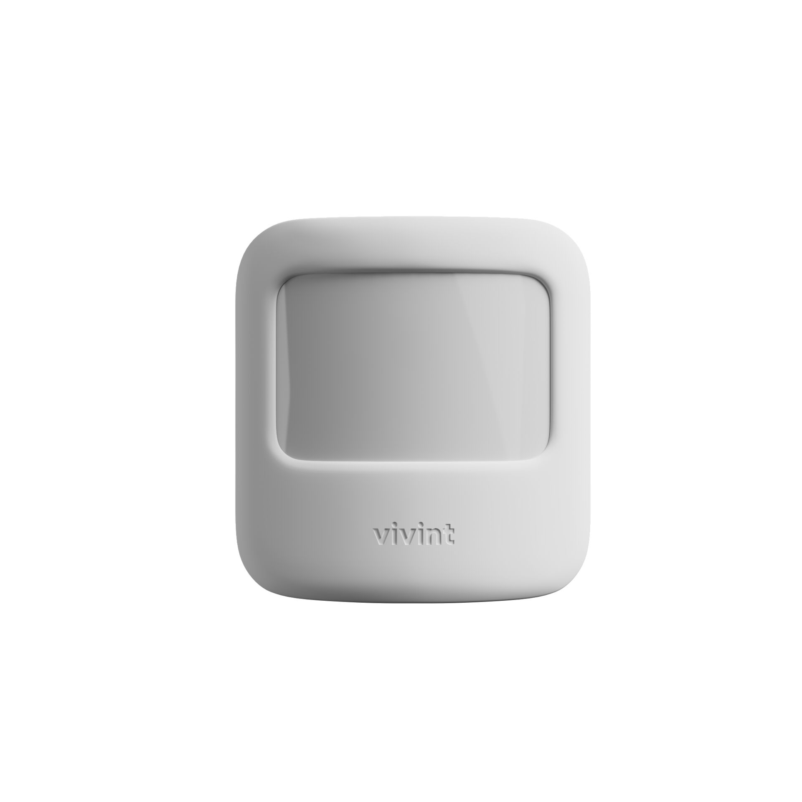

# Program/Install Sensors

<figure><figcaption></figcaption></figure> <figure><figcaption></figcaption></figure> <figure><figcaption></figcaption></figure>



#### Program all sensors.

1. Each sensor must be named according to the location it will be installed.
2. **DO NOT** name sensors with general names like "Window," "Window 1," etc. Be specific.
3. Each sensor needs a unique identifier.



#### Install all sensors in their final locations.


