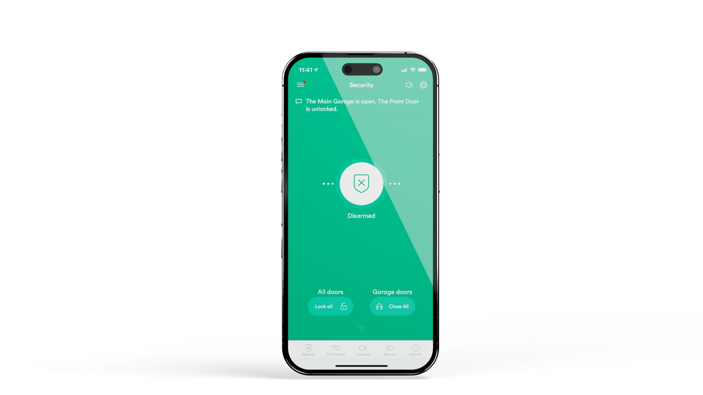

# 5. Setup App(s)

<figure><figcaption></figcaption></figure>



#### Vivint App

Send invite for [Vivint App](https://prosource.vivint.com/vivint-app/) and have customer create account.



#### MyQ App

If installing MyQ, instruct customer to download the MyQ app and create account.




[Vivint App on ProSource](https://prosource.vivint.com/vivint-app/)


