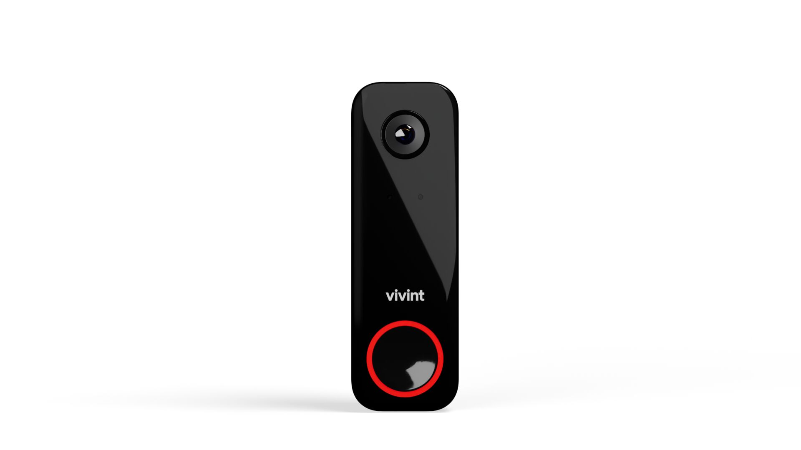

# 3. Install the DBC Pro

<figure><figcaption></figcaption></figure>



### Install the DBC Pro.

* The DBC will be in a fixed location. It needs to be installed first to help determine where the panel is going to be located.




### DBC Pro Resources

* [DBC Pro on ProSource](https://prosource.vivint.com/sop-dbc-pro-gen2/)
* [DBC Power Uptraining](https://vivint-my.sharepoint.com/:p:/g/personal/ashley_martin_vivint_com1/EXWoYT4fWhxOo5qpfU7TftsBCbj5N9IGB94I4kPP_7pHVg?e=a0JzO2)
* [DBC Install Audit Checklist (for Managers)](https://vivint-my.sharepoint.com/:w:/p/bheath2/ESfgZreYjvhDuyFBIPv9cNEBzdNHyWLKOhKjudOQOy20Vg?e=kCvVaJ)

