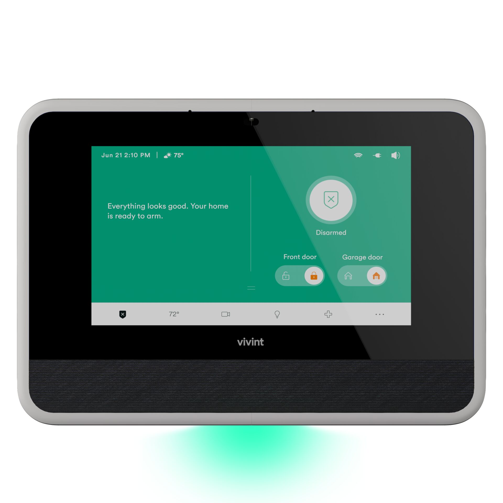

# 4. Connect/Register the Panel

<figure><figcaption></figcaption></figure>



### Connect the Panel to Wi-Fi and register.

* Registering the panel at the beginning of the install is beneficial for the following reasons:
  * Identify potential issues with cell unit. If the cell unit needs activated or additional troubleshooting, you can do this while continuing with other work.
  * Allows you to send App invite to customer.
  * Speed up troubleshooting if you need to contact Field Tech Support.




[Smart Hub on ProSource](https://prosource.vivint.com/sop-smart-hub/)

