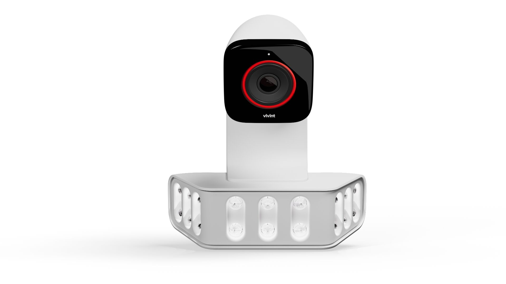

# 8. Install/Pair the ODC Pro(s)


#### POTENTIAL DAMAGE:  Over-Rotation During Installation

**CRITICAL:** When tightening the collar of the camera after determining the angle the camera will point in, be sure to hold the camera head stationary while rotating the locking collar in a counterclockwise direction facing the camera. **Do Not Rotate the Camera Head to Tighten.**


<figure><figcaption></figcaption></figure>



### Install the ODC Pro(s).

* Use the AirPort Utility app to identify the best location for the Wi-Fi bridge.
  * Must be -65 or better from the Wi-Fi bridge to the panel.



### Pair the ODC Pro(s).

* Once the pairing process begins, move onto the next step. Let the camera fully update and come online before doing other programming.
  * If installing multiple ODC’s, repeat steps 1 and 2.




[ODC Pro on ProSource](https://prosource.vivint.com/sop-odc-pro-gen2/)


