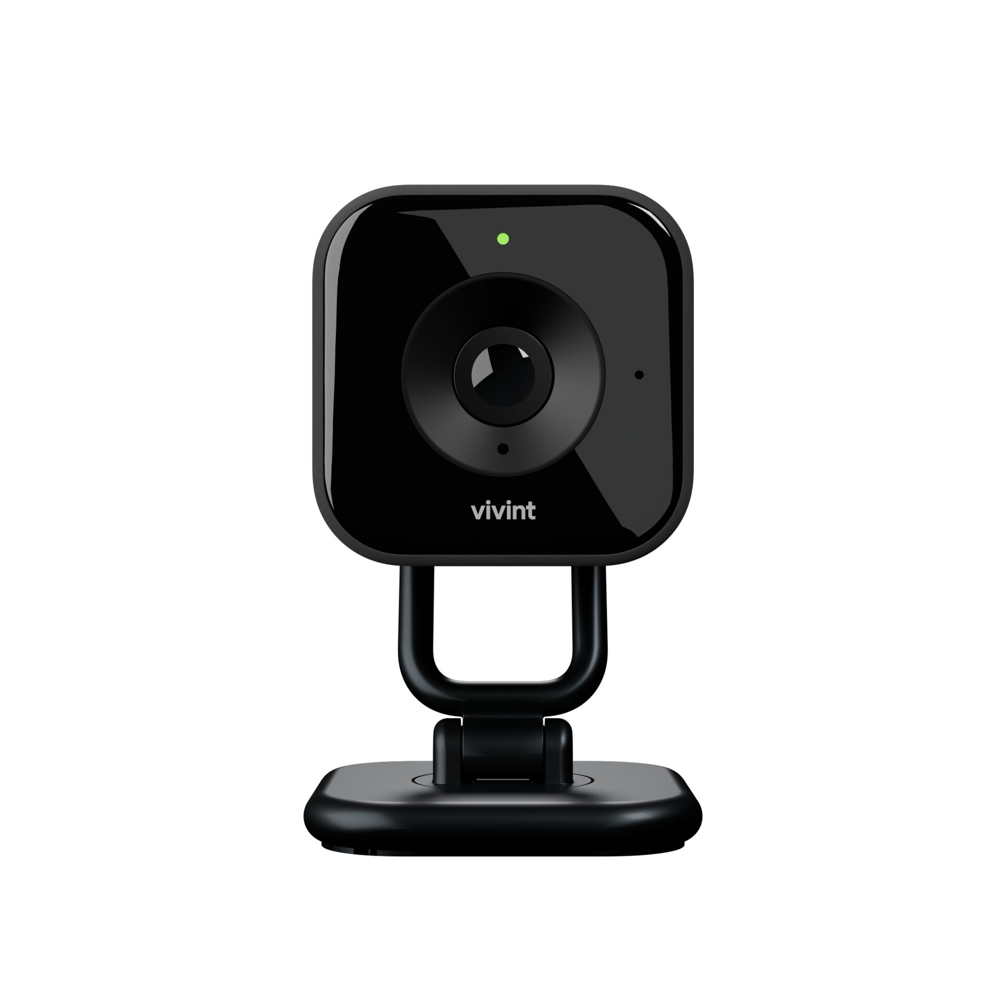

# 9. Pair the IDC Pro(s)

<figure><figcaption></figcaption></figure>



### Pair the IDC Pro(s).

* Plug the camera in close to the panel for pairing.
* After the camera is online and updated, customer can relocate to desired location.




[IDC Pro on ProSource](https://prosource.vivint.com/indoor-camera-pro/)


