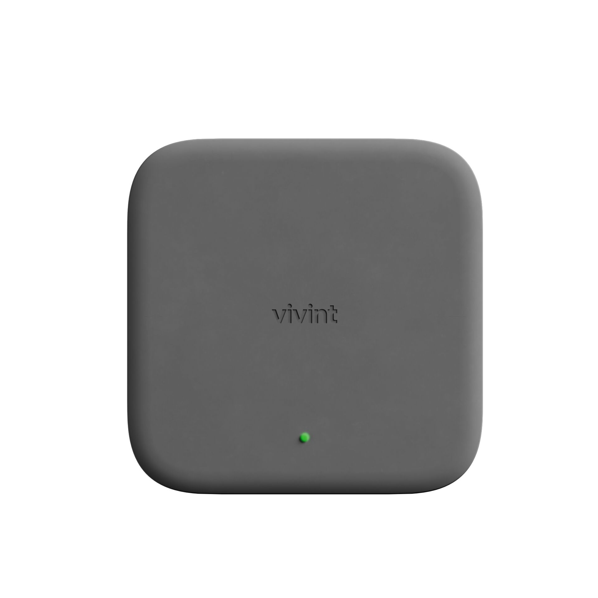

# 2. Zigbee Bridge

<figure><figcaption></figcaption></figure>



### Plug Zigbee Bridge into the customer's router (if installing lighting).

* The Zigbee bridge will take up to 15 minutes to update. Starting this process at the beginning of the install will ensure the update is complete when you start pairing Zigbee devices.




[Smart Lighting on ProSource](https://prosource.vivint.com/smart-lighting/)


