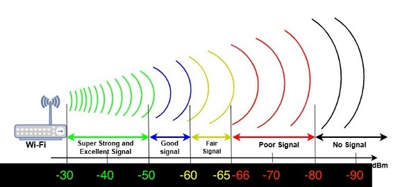

# 3. Doorbell / Chime

<figure><figcaption></figcaption></figure>

### 1. Confirm RSSI is between -30 to -65 dBm, Run Speed Test, Check Voltage, Look for possibility of pinching wires.

More details...

* Ask the customer where their existing doorbell chime is located.

- Pull up **Airport Utility** on your phone/tablet.
  * Tap Wi-Fi Scan
  * Tap Scan
  * **Find SSID of the customer's home router:**
    * **2.4GHz:**  Channels 1-13
    * **5GHz:**  Channels 36-165

* **You should be looking for 2.4 GHz channels ONLY.**
  * DBC will **NOT** connect to a 5 GHz channel.
  * If the home router SSID on 2.4 GHz is not between -65 and 0:
    * Add a **Wi-Fi Extender**
    * Install the TP-Link Wi-Fi Extender
      * [**TP-Link WiFi Extender Programming**](https://prosource.vivint.com/wp-content/uploads/2024/12/TP-Link-Wi-Fi-Extender.pdf)
  * **Run a Speed Test** using [speedtest.net](https://www.speedtest.net) with the customer’s phone
    * Ensure the customer’s phone is connected to the TP-Link Bridge before running test.
    * At least 5 Mbps Download and 2.5 Mbps Upload speeds are required.

### 2. Remove doorbell.

### 3. Check outside HVAC unit to determine Heat Pump/Conventional.

