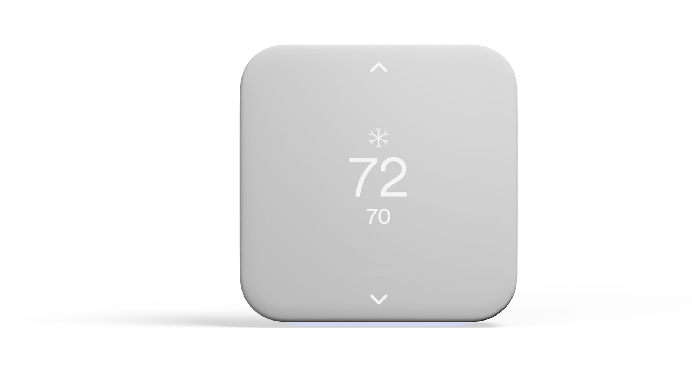

# 4. Thermostat Installation

<figure><figcaption></figcaption></figure>

### 1. Go back inside and your thermostat should be working to finalize the pre-install test.

* If set to **HEAT**:
  * If the heat is **not blowing,** don’t touch the thermostat.
  * If heat **is blowing,** walk outside and see if the **condenser fan** is spinning.
    * If the fan IS spinning, its a Heat Pump system.
    * If Fan IS NOT spinning, its a Conventional system.
  * If set to **COOL**:
    * And Cool is not blowing, don’t touch the Thermostat
    * If Cool is blowing, proceed to installation.

### 2. Start the Thermostat Flow.

* Take an accurate before photo.
* Find Furnace and look for indicators of Gas or Electric.
  * Gas will have both Flue Pipes and Gas Lines.
* Input accurate wire terminals:
  * Standard Common wires are: **C, O, B, W, W2, Y, Y2, G, R, RC, RH,** etc.
* Understand the unit type (Heat Pump or Conventional):
  * By checking if the outside unit is spinning while heat is blowing inside.

### 3. Power down the Furnace/Air Handler.

* Turn the Fan for the Furnace to the “ON” position.
  * Ensure it is NOT on Auto.
* Turn off Power
  * Use Breaker on front of Handler
  * Turn off HVAC switch (Looks like a normal light switch) near furnace or handler
  * Turn off Breaker in Main Home Breaker panel.&#x20;
    * You can also confirm power is off if it has a common wire (C terminal).
      * Remove any batteries from Thermostat
      * Put therm faceplate back on
      * Lights should return to the old therm faceplate
      * When you turn off the right breaker or switch, the lights will go away
  * When you turn off the power using the correct breaker/switch, the fan will stop instantly.
    * Do NOT proceed until the power is off. And fan is not blowing.

### 4. Install the Thermostat.

* Use the therm flow to confirm wire terminals and programming.
* Take the after photo for the Therm Flow.
  * Make sure that all wires are connected.
  * Make sure that backplate is mounted.
  * Make sure the photo is legible to anyone viewing (ie: Claims Team, Customer Care, VFT, etc.).

### 5. Attempt to pair the thermostat so that it fails.

* This is to ensure you get to programming.
* This process usually takes less than 30 seconds.

### 6. Program the therm using the Therm Flow Cheat Sheet.

* Heat Pump or Conventional
* Gas or Electric
* Use programming cheat sheet in Therm Flow to determine configuration.

### 7. Test the new thermostat.

* If the last system that was tested was HEATING, start the test with heating.
* If the last system that was tested was COOLING, start the test with cooling.

