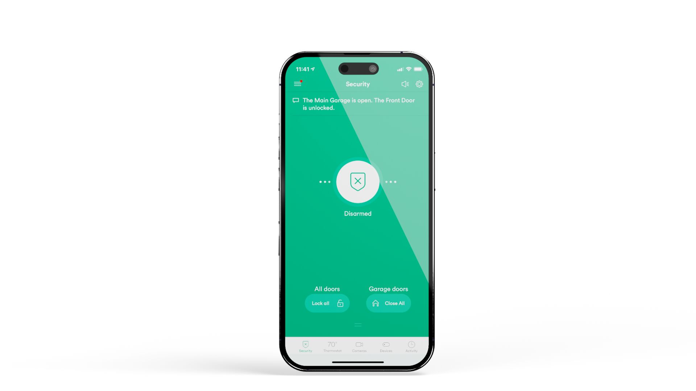

# 6. App & Devices Setup

<figure><figcaption></figcaption></figure>


**ONLY USE THE CUSTOMER'S DEVICE FOR ANY OF THE STEPS OUTLINED BELOW!**

Train the customer to use the physical device while standing at each device after adding it to the Vivint app.


### 1. Send the customer an App Invite.

### 2. Assist the customer with logging into the app.

### 3. Set up all applicable devices (Bridge, Thermostat, Doorbell, Chime, WiFi Extender).

### 4. Train the customer as you go.
