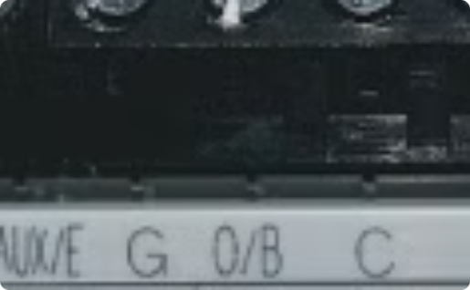

# HVAC/Thermostat Flow


### Thermostat Flow Best Practices

* Take level and clear photos of the before/after thermostat wiring and wall plate setup. **Blurry or unfocused pictures should NOT be used.**
* Take care to ensure you have the **correct wiring setup.**
* Ensure the thermostat is **correctly programed** (including identifying the **HVAC fuel type**).
* Prevent damage with **properly-trimmed copper wiring.**


## Why do we have a thermostat "flow?"

We have many stakeholders at Vivint who depend on the proper execution of the thermostat flow to support our field installers and customers. Here are just a few:

* **Customer Care:**  Troubleshooting with customers.
* **Field Tech Support:**  Troubleshooting with Pros.
* **Home Damage Team:**  Processing home damage claims.

### Why This Training Matters

* **Prevent System Failures:**  Understanding how incorrect installs cause major system failures is crucial. A single wiring error can lead to damaged equipment, unhappy customers, and unnecessary service calls.
* **Reduce Service Calls:**  By identifying and correcting install issues early, you can significantly reduce the number of follow-up service calls, improving both customer satisfaction and operational efficiency.

### Improving Pro Accuracy

<details>

<summary>What steps can you take to improve your accuracy?</summary>

1. Take accurate **before photos** (these will be the source of truth for future troubleshooting).
2. Use the Thermostat Flow in Tech Genie as a TOOL, **not a TASK.**
3. Identify the **correct fuel type** (Gas or Electric). This is VERY important.
4. Properly **test the system** both **before and after.** Fix problems while you're on-site.
5. Only use **one power source;** either **C-Wire or Batteries.**
6. Program the thermostat from its **FINAL LOCATION.**



**DO NOT** take pictures of phone screens. These are NOT considered original photos.


</details>

### Common Install Mistakes

<details>

<summary>Wiring Errors</summary>

Incorrect wire connections often lead to heating or cooling failures. These fundamental errors not only prevent systems from functioning properly but can also cause the system to operate contrary to what's required. This frustrates customers and results in increased service calls.

</details>

<details>

<summary>Short Circuits</summary>

Exposed wires or incorrect connections can lead to short circuits. These shorts can damage fuses and transformers. Addressing these issues is costly and often necessitates emergency services that could have been avoided.

</details>

<details>

<summary>Programming Errors</summary>

Setting up the incorrect system type or thermostat settings can lead to significant issues. Even with flawless wiring, improper programming can cause systems to operate poorly or fail entirely. This may result in permanent damage to essential components, such as heat strips.

</details>

## Overview of HVAC Types


Each type of system needs different thermostat wiring and setup. Finding out which system you have is the first important step for correct installation.


### Heat Pump / Air Handler

Systems that both heat and cool using refrigerant, mostly running on electricity. They can include backup gas heating. These need special wiring, especially for the part that switches between heating and cooling (O/B wire).

#### How to Spot Them

<div align="left"><figure><figcaption></figcaption></figure></div>

* O/B wire at thermostat (controls reversing valve)
* No gas pipe (runs on electricity)
* Has emergency heat option
* Outdoor unit works during heating

#### Look at Model Numbers

<div align="left"><figure><figcaption></figcaption></figure></div>

For heat pumps, it's the outside unit:

* Trane: XR14**HP** (Heat Pump)
* Carrier: 25HCE4 (Heat Pump)
* Goodman: GSZ140361\*\* (Heat Pump)


Search the model number online if you're unsure.


#### Watch Out For

<div align="left"><figure><figcaption></figcaption></figure></div>

* Wrong O/B wiring can make the system cool when it should heat, or heat when it should cool.
* Heat pumps need 5-15 minutes to start up. Wait long enough when testing to avoid thinking the system is broken when it's not.

### Furnace / AC

Common systems with separate heating (furnace) and cooling (AC) units. They typically use gas, electric, or oil for heat and use a different thermostat setup than heat pumps.

#### Key Identifiers

* Flue pipe (metal or PVC venting to outside)
* Gas line near the furnace
* No reversing valve terminal

#### Model Number Indicators (sticker inside furnace)

* Carrier: 24ACB3 (AC Condenser)
* Trane: XR13A (Air Conditioner)
* Goodman: GMVC96 (Gas Furnace)


Search the model number online if unsure.


#### Performance Issues

* Misconfiguring staging (1-stage vs. 2-stage) can significantly affect system performance, causing inefficient operation, short cycling, or inability to maintain temperature.

### Boiler Systems (Radiant Heat)

Systems that heat by sending hot water through radiators or pipes under floors. They usually don't provide cooling and have their own unique wiring.

#### Key Identifiers

* Look for radiators or baseboard heaters
* Look for water pipes instead of duct
* 2-wire thermostats

#### Model Number Indicators

* Weil-McLain CGA-4 (Gas)
* Navien NCB-240E (Combi)
* Burnham ESC4BNI (Steam)


Search the model number online if unsure.


#### Wiring Differences

* Boiler systems are wired differently than forced-air systems. They mainly use just W and R terminals for basic operation. Extra terminals may be used for zone control or to turn pumps on and off.

### \*\* Honeywell Thermostats

<div align="left"><figure><figcaption></figcaption></figure></div>

**These thermostats share terminals for both heat pumps and conventional systems.**

You have a 50% chance of installing these incorrectly if you can't identify the system type properly. _**However, you have a 100% chance of getting it right if you test the system.**_

```
O/B share with W
W2 Share with Aux
E share with Y2
```

## Identifying HVAC System Components

### Check Exterior Unit Operation

<div align="left"><figure><figcaption></figcaption></figure></div>

If the outdoor unit runs during winter heating, it's likely a heat pump. Traditional AC units should not operate during heating mode.

### Look for Gas Lines and Flue Pipes

<div align="left"><figure><figcaption></figcaption></figure></div>

The presence of a gas line and flue pipe indicates a furnace/AC system.

### Inspect for Radiators or Baseboard Heat

<div align="left"><figure><figcaption></figcaption></figure></div>

These heating elements indicate a boiler system. Look for water pipes rather than air ducts throughout the home.

### Verify Manufacturer Labels

<div align="left"><figure><figcaption></figcaption></figure></div>

Check model numbers on equipment labels.

<details>

<summary>Identifying Furnace Brand Name</summary>


</details>

<details>

<summary>Identifying Gas vs. Electric Furnaces</summary>

* Flue Pipes and Venting always indicate a **gas-powered system.**
* No venting pipes? **The furnace is electric.**


</details>

<details>

<summary>Refrigeration Lines (Gas vs. Electric)</summary>


</details>

## Pre & Post-Installation Testing

* Testing systems before installation helps avoid costly callbacks and unhappy customers. Always run the existing system through heating and cooling cycles before replacement. This helps identify existing HVAC problems that might be blamed on your new thermostat installation. This can also help identify equipment.
* After installation, testing is equally important. Test the system in all modes (heat, cool, fan) while checking the temperatures. Evaluate special features like emergency heat for heat pumps and multi-stage operation where necessary.

### Overview of Thermostat Wiring Terminals

<div align="left"><figure><figcaption></figcaption></figure></div>

<div align="left"><figure><figcaption></figcaption></figure></div>

## Common Thermostat Wiring Errors

#### Heat Pump W/W2 Errors

<div align="left"><figure><figcaption></figcaption></figure></div>

* Techs often confuse W and W2 terminals on heat pumps. This causes the system to heat all the time. Remember: for heat pumps, use W2 for backup heat, not the W terminal (which is for regular systems).

#### Trane/American Standard B Terminal Mix-Ups

<div align="left"><figure><figcaption></figcaption></figure></div>

* On these thermostats, the B terminal is actually a common wire that should connect to the C terminal. If wrongly connected to the O/B terminal, it will damage the system. Always check what each terminal does for specific brands.

#### C-Wire Issues

<div align="left"><figure><figcaption></figcaption></figure></div>

* Incorrect C wire connections can harm your system. While basic thermostats don't need it, smart thermostats need the C wire for power. If a C wire is present, connect it correctly to avoid problems.

#### Non-Compatible Systems

<div align="left"><figure><figcaption></figcaption></figure></div>

* Don't connect our thermostats to these HVAC systems without checking first. Just matching wire colors can damage both devices because different brands use different terminal labels. Always check terminal labels, not wire colors, and use the therm flow before installing.

### How Wiring Mistakes Lead to Damage

<div align="left"><figure><figcaption></figcaption></figure></div>

### Taping Off Unused Wires

<div align="left"><figure><figcaption></figcaption></figure></div>

## Common Programming Errors

<div align="left"><figure><figcaption></figcaption></figure></div>

### How Programming Mistakes Lead to Damage

<div align="left"><figure><figcaption></figcaption></figure></div>

## Testing HVAC Functions



### Troubleshooting: No Heat, No Cool, No Fan

<div align="left"><figure><figcaption></figcaption></figure></div>

## Examples & Best Practices

<details>

<summary>Exposed Copper Wiring / Dual Thermostats</summary>

* **BE CAREFUL:**  Exposed copper wiring can cause shorts or blown transformers.
* Remember that **dual-thermostats** can be either a **Heat Pump or a Conventional system.**


</details>

<details>

<summary>Bad BEFORE Photos</summary>

* When disassembling the existing thermostat terminal, be sure to go until you see the **terminal letters**.
* **Clean any dust or smudges** from the wiring terminal so wires and their positions are clearly visible.
* Confirm you can see the **wires and letters** in your photos.
* **DO NOT** remove wires before taking the photo.



**DO NOT** take pictures of phone screens. These are NOT considered original photos.


</details>

<details>

<summary>Good AFTER Photos</summary>

* The photos of wiring you submit should be **straight forward, clear, and legible** (where you can see all of the letters easily).



**DO NOT** take pictures of phone screens. These are NOT considered original photos.


</details>

<details>

<summary>Bad AFTER Photos</summary>

* **DO NOT** take blurry photos.
* **DO NOT** include inanimate objects in the photo.
* **DO NOT** take pictures that are all black, red, or of the thermostat faceplate.



**DO NOT** take pictures of phone screens. These are NOT considered original photos.


</details>

